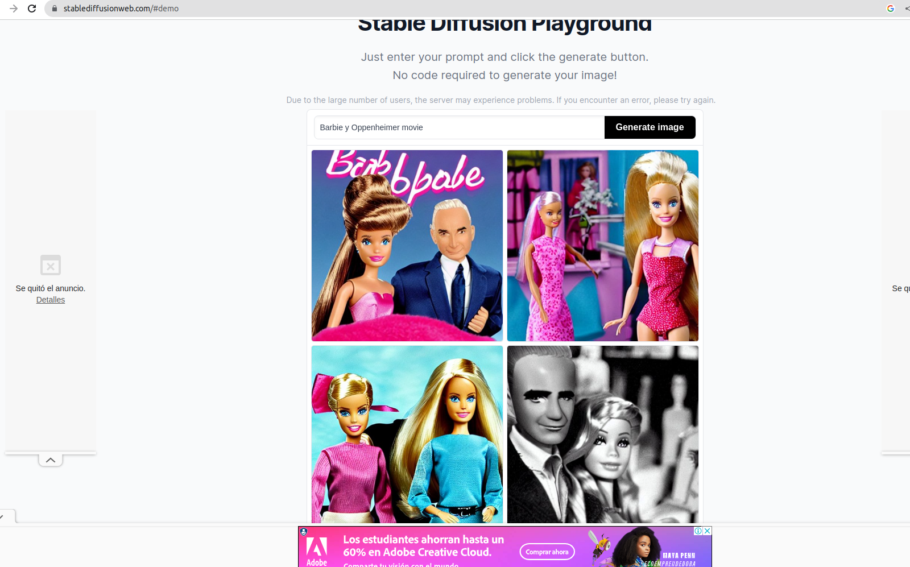

# Stable Diffusion 
https://learn.deeplearning.ai/chatgpt-prompt-eng

Stable Diffusion is a latent text-to-image diffusion model capable of generating photo-realistic images given any text input, cultivates autonomous freedom to produce incredible imagery, empowers billions of people to create stunning art within seconds.

Create beautiful art using stable diffusion ONLINE for free.

Stable Diffusion es un modelo de aprendizaje automático desarrollado por Runway y LMU Múnich​para generar imágenes digitales de alta calidad a partir de descripciones en lenguaje natural o estímulos. Fuente: Wikipedia

https://stablediffusionweb.com/#demo

___________________________________________________________
